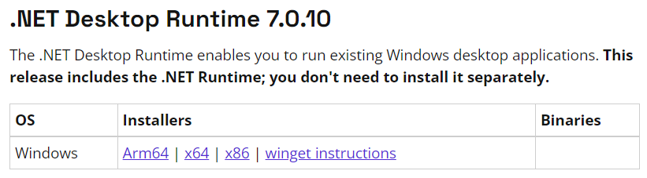

# BDOAlchemyStoneTapper
 [中文版](/README_CN.md)

A project that automates Black Desert Online alchemy Stone tapping, with the help of yolov8 visual object 
detection and simulated key strokes.

- V1.1.0 version and onwards supports both polish and grow
- Any version of BDO works, no matter the language and server.
- Use at your own risk.

## Table of contents

- [Tutorial](#Tutorial)
- [To do](#To-Do)
- [What's included](#whats-included)
- [Creators](#creators)
- [Errors](#Errors)
- [Copyright and license](#copyright-and-license)

## Tutorial
[Download the compiled package here](https://github.com/NAinfini/BDOAlchemyStoneTapper/releases)

StoneTapper is the compiled software, medium model includes enhanced AI models

1.Open software in administrator mode

This is so the software gains the ability to simulate mouse clicks and keyboard inputs
2.Select Stone type and select the stones to polish/grow, and enter long,short delay, 
normally 20,120. long delay is the delay before hitting grow button, as it normally
takes a second for that button to get ready, short delay is every other delay related to clicking

3.Select Working are with the Green border

4.Open Polish/Grow window and press button to start


```
Heads up:
     1.select skip animation and select "max number" before starting
     2.Make sure Alchemy stones and materials are detected.
     3.Make sure there is enough material in the inventory.
     4.CTRL + alt + DEL is the only way to break the program as it is using 
     dirextX keyboard input.
     5.Program only supports x64 systems
     6.If AI predictions is not accurate enough, consider using the larger,slower but more 
     accurate Model pack,download separately from release page.
```

## To-Do

This is a hobby project so don't expect too much.

- [ ] Automated restocking
- [ ] Material existence check during tapping
- [ ] Black stone existence check during tapping
- [ ] Better AI model
- [ ] More localizations
- [ ] Manually set Material/BlackStone locations
- [X] Manually set Delay
## What's included


```text
BDOAlchemyStoneTapper
    ├──Destruction.onnx                 Model for Destruction stones
    ├──Protection.onnx                  Model for Protection stones
    ├──Life.onnx                        Model for Life stones
    ├──BDOAlchemyStoneTapper.exe    Executable
    ├──DefaultLanguage.json             English language
    ├──DefaultLanguage_cn.json          Chinese language
    └──RunTime files                    Required runtime files
```
## Errors

If run into "ASP .net package not installed error" go to [Microsoft](https://dotnet.microsoft.com/en-us/download/dotnet/7.0) 
for the **desktop** runtime package(Get X64 version.)


## Creators

[NA_infini](https://github.com/NAinfini)

## Copyright and license

Code released under the [MIT License](https://reponame/blob/master/LICENSE).

Enjoy :metal:
