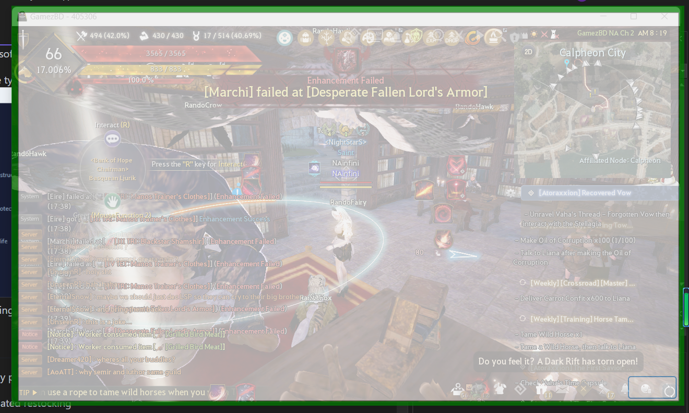

# 黑沙炼金石自动连点器
 [English Version](/README.md)

这是个基于yolov8 和模拟输入的用于 黑色沙漠 自动升级炼金石的项目

- V1.1.0 及以上版本均支持打磨于升级选项。
- 任何版本,语言，地域，服务器均可使用。
- 请酌情使用，被封号概不负责。
- 想要中文只需要将 DefaultLanguage_cn.json 更名为 Defaultlanguage.json 即可

## Table of contents

- [教 程](#tutorial)
- [计 划](#to-Do)
- [安 装 包](#whats-included)
- [作 者](#creators)
- [版 权](#copyright-and-license)

## Tutorial
[下载整合包 ](https://github.com/NAinfini/BDOAlchemyStoneTapper/releases)

StoneTapper 解压后可直接运行，medium model为加强版AI, 下载替换原本模型即可。


1.使用管理者模式进入程序，不然程序无法模拟鼠标点击


如果出现 "ASP .net package not installed error" 报错， 那么你需要到 [Microsoft](https://dotnet.microsoft.com/en-us/download/dotnet/7.0) 
官网并下载 **桌面端** 运行时文件。需要下载x64版本的安装包，mac用户需下载ARM64版本。


2.选择想要升级、打磨的炼金石，然后输入长短延迟，一般为20,120.长延迟为点击生长按钮前
的延迟，因生长按钮通常需要额外的时间才能进行点击， 短延迟为除此以外一切点击延迟

3.用绿色边框选择工作区域

4.在游戏内打开打磨窗口并点击对应按钮

```
提示:
     1.开始点炼金石前选择跳过动画选项， 以及最大数量选项
     2.确认炼金石以及材料能被正确识别，开始以前移除选中的炼金石。
     3.确认有足够数量的材料以及黑石，而且能被识别（将炼金石放入打磨框使材料与黑石亮起）
     4.CTRL + alt + DEL 可以用来强行停止程序，但因游戏是基于dirextx开发的，游戏会截停按键信息
     5.本程序只支持64位系统。
     6.如发现AI结果并不准确，可使用体积更大，速度更慢，但结果更精确的AI模型包,需在release中单独下载。
```

## To-Do

目前有以下想法等待开发。

- [ ] 自动填补材料
- [ ] 打磨时自动检查是否有剩余材料
- [ ] 升级时自动检查是否有剩余黑石
- [x] 加强AI准确率
- [ ] 本地化
- [ ] 手动选择材料黑石位置
- [x] 手动选择延迟
## What's included


```text
BDOAlchemyStoneTapper
    ├──Destruction.onnx                 破坏炼金石相关模型
    ├──Protection.onnx                  保护炼金石相关模型
    ├──Life.onnx                        生命炼金石相关模型
    ├──BDOAlchemyStoneTapper.exe        程序
    ├──DefaultLanguage.json             英语文件
    ├──DefaultLanguage_cn.json          中文文件-更改名称启用
    └──RunTime files                    所需文件
```

## Creators

[NA_infini](https://github.com/NAinfini)


## Copyright and license

版权 [MIT License](https://reponame/blob/master/LICENSE).

Enjoy :metal:
