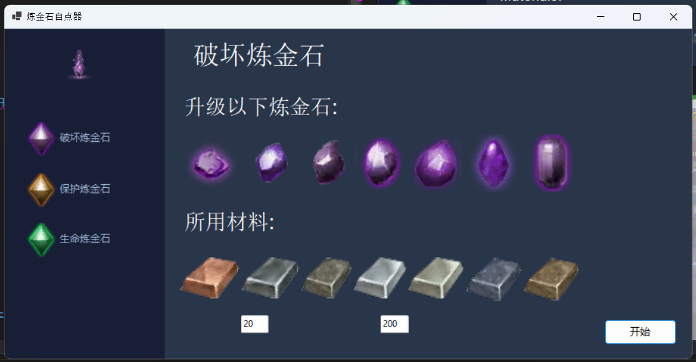

# 黑沙炼金石自动连点器
 [English Version](/README.md)

这是个基于yolov8 和模拟输入的用于黑沙自动升级炼金石的项目

- V1.1.0 及以上版本均支持打磨于升级选项。
- 任何黑沙版本以及服务器均可使用，此项目基于图片识别，并非文字识别。
- 请酌情使用，被封号概不负责。

## Table of contents

- [教 程](#Tutorial)
- [计 划](#To-Do)
- [安 装 包](#whats-included)
- [作者](#creators)
- [版 权](#copyright-and-license)

## Tutorial
1.使用管理者模式进入程序，不然程序无法模拟鼠标点击


2.选择想要升级、打磨的炼金石

3.用绿色边框选择工作区域

4.在游戏内打开打磨窗口并点击对应按钮

```
Heads up:
     1.开始前选择跳过动画选项， 以及最大数量选项
     2.确认炼金石以及材料能被正确识别
     3.确认有足够数量的材料以及黑石
     4.CTRL + alt + DEL 可以用来强行停止程序，但因游戏是基于dirextx开发的，游戏会截停按键信息
```

## To-Do

目前有以下计划，但不一定开发，毕竟是闲的无聊搞得项目

- [ ] 自动填补材料
- [ ] 打磨时自动检查是否有剩余材料
- [ ] 升级时自动检查是否有剩余黑石
- [ ] 加强AI准确率
- [ ] 本地化
- [ ] 手动选择材料黑石位置
## What's included

[Grab compiled package here](https://github.com/NAinfini/GameZBDAlchemyStoneTapper/releases)

```text
GameZBDAlchemyStoneTapper
    ├──Destruction.onnx                 破坏炼金石相关模型
    ├──Protection.onnx                  保护炼金石相关模型
    ├──Life.onnx                        生命炼金石相关模型
    ├──GameZBDAlchemyStoneTapper.exe    程序
    ├──DefaultLanguage.json             英语文件
    ├──DefaultLanguage_cn.json          中文文件-更改名称启用
    └──RunTime files                    所需文件
```

## Creators

[NA_infini](https://github.com/NAinfini)

## Copyright and license

版权 [MIT License](https://reponame/blob/master/LICENSE).

Enjoy :metal: